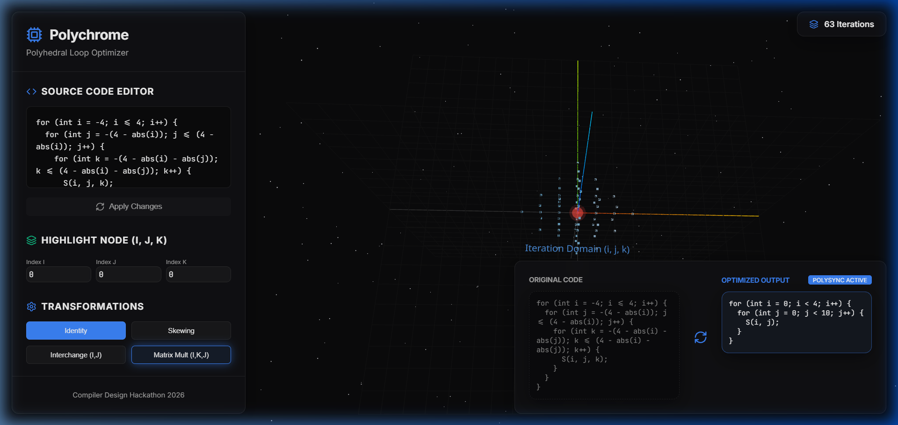

# 💎 Polychrome | Polyhedral Loop Optimizer



**Polychrome** is an interactive, web-based tool designed for visualizing and optimizing nested loop iteration spaces using the **Polyhedral Model**. Built for the **Compiler Design Hackathon 2026**, it provides a stunning 3D interface to explore loop transformations, iteration domains, and dependency highlighting.

---

## ✨ Features

- **🚀 Real-time 3D Visualization**: Explore complex iteration domains (including 3D Diamond/Octahedron shapes) using Three.js and React-Three-Fiber.
- **🛠️ Interactive Source Editor**: Edit loop bounds and patterns directly. Supports rectangular and non-rectangular (polyhedral) domains.
- **🔄 Polyhedral Transformations**:
  - **Identity**: Standard loop execution.
  - **Loop Skewing**: Transform loops for parallelism.
  - **Interchange (I, J)**: Swap loop orders to improve cache locality.
  - **Matrix Mult Optimization**: specialized (I, K, J) order for high-performance matrix multiplication.
- **🔦 Node Highlighting**: Input specific $(i, j, k)$ coordinates to see them glow in the 3D space with real-time lighting effects.
- **📐 Mathematical Insights**: Live LaTeX rendering of Iteration Domain inequalities ($\mathcal{D}$) and Transformation Matrices ($T$).
- **💻 Optimized Code Generation**: See the resulting optimized C code for any transformation in real-time.

---

## 🛠️ Tech Stack

- **Core**: [React](https://reactjs.org/) + [Vite](https://vitejs.dev/)
- **Graphics**: [Three.js](https://threejs.org/) + [React-Three-Fiber](https://docs.pmnd.rs/react-three-fiber) + [Drei](https://github.com/pmndrs/drei)
- **Math**: [KaTeX](https://katex.org/) for mathematical notation.
- **Styling**: Vanilla CSS with modern glassmorphism and neon aesthetics.
- **Icons**: [Lucide React](https://lucide.dev/)

---

## 🚀 Getting Started

### Prerequisites
- Node.js (v18+)
- npm or yarn

### Installation
1. Clone the repository:
   ```bash
   git clone https://github.com/your-repo/polychrome.git
   cd polychrome
   ```
2. Install dependencies:
   ```bash
   npm install
   ```
3. Start the development server:
   ```bash
   npm run dev
   ```
4. Open [http://localhost:5173](http://localhost:5173) in your browser.

---

## 📖 How it Works

The tool uses a **Polyhedral Engine** to map original iteration points $(i, j, k)$ through a transformation matrix $T$:
$$ \vec{x}' = T \vec{x} $$
Where $\vec{x}$ is the original iteration vector and $\vec{x}'$ is the transformed vector in the new iteration space.

For the **Diamond Loop** pattern, the domain is defined by:
$$ \mathcal{D} = \{ (i, j, k) \in \mathbb{Z}^3 \mid |i| + |j| + |k| \le N \} $$

---

## 🏆 Hackathon Project
This project was developed as part of the **Compiler Design Hackathon 2026** to make complex loop optimization concepts accessible and visually intuitive.

**Developer**: Sidharth Nair, N S Balaji
**License**: MIT
